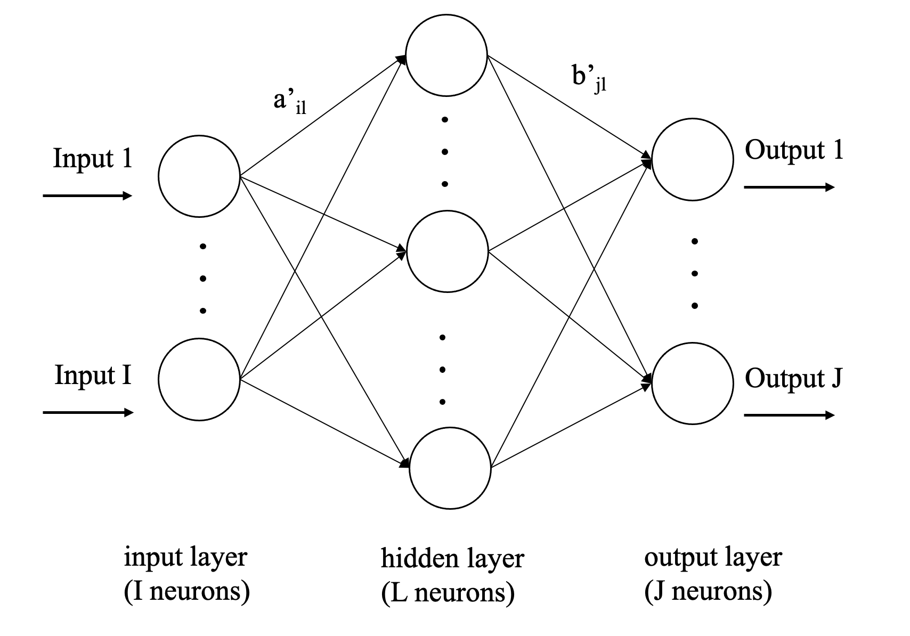

```{r, include=FALSE, message=FALSE}
library(lba)
library(lbann)
library(knitr)
knitr::opts_chunk$set(echo = FALSE, message = FALSE)
library(kableExtra)
library(keras)
library(tensorflow)
library(ggplot2)
library(rmarkdown)
```


# Introduction

Compositional data are non-negative constant-row-sum data in a rectangular matrix. Due to this non-negativity and constant-row-sum, interest usually goes out to, for each row in the matrix, relative quantities for the different column categories that add up to one [@PG2006]. Compositional data are present in many fields, such as archaeology, social science and medical science [@Aitchison1994; @Aitchison2008; @baxter2006; @PG2017; @raun2016]. Often the rows represent individuals, or groups of individuals, and the columns levels of a response variable. As an example, one can think of several groups of people from different continents choosing different ways of payment, where for each group the number of individuals is subdivided over the ways of payment. The non-negativity and the constant row sum distinguish compositional data from other types of data. Therefore, classical statistical techniques that rely on product-moment covariance and correlation are poorly suited for compositional data [@Aitchison1994; @Aitchison2008]. 

Latent budget analysis (LBA) [@Heijden1992] is one of the statistical methods to study compositional data. A row of conditional proportions in the rectangular matrix is called an observed budget. LBA approximates the observed budgets with a mixture of latent budgets, where the latent budgets and the mixture weights are estimated from the data. LBA is usually applied to a contingency table with $I$ groups (levels of the categorical explanatory variable) and $J$ levels of the response variable. LBA allows to study the dependence of the response variable on the categorical explanatory variable(s). However, in prospective studies, knowledge of the $J$ categories of the response variable is usually missing and there is only information on the categorical explanatory variable(s). A challenge of predicting the $J$ categories based on $I$ groups is imposed. For this purpose, the traditional LBA is restricted as it lacks the ability of predicting the response variable. 

In previous work, \cite{SM2001} extended LBA with a constrained neural network (NN) model, which in the rest of the article is called the constrained NN extension of LBA. Their method allows to use LBA as a prediction model. However, the model performance in prediction was not explicitly discussed there. We argue that using the constrained NN extension can hamper high accuracy in prediction. Here we propose to use unconstrained NN techniques to analyse compositional data and provide add-ons for LBA. Two research questions are answered: (1) How can we equip LBA with the ability to predict the response variable based on the explanatory variable(s) in prospective studies? (2) Can we achieve a better prediction ability with the new, unconstrained NN-based version of LBA than with the constrained NN extension of LBA?

In the remainder of this paper, in Section \ref{sec:bg}, we explain LBA and the extension proposed by Siciliano and Mooijaart. In Section \ref{sec:method}, an unconstrained NN extension of LBA, LBA-NN, is proposed for analysing and predicting compositional data. We shed light on using the importance table and plot that show the relative importance of all explanatory variables on the response variable to obtain a stable interpretation of LBA-NN. The LBA-NN-K-means approach that applies K-means clustering on the importance table is proposed for LBA-NN as a qualitative comparison with LBA. Besides, we compare LBA and LBA-NN quantitatively based on six standard measurements of the prediction ability. We provide an R function for LBA-NN at GitHub  \footnote{\label{footnote:lbann} \url{https://github.com/ZhenweiYang96/lbann}}. In Section \ref{sec:app}, we apply LBA-NN on different example datasets. In Section \ref{sec:dis}, a brief discussion about LBA-NN and the expectation of the potential usage is shown. 

# Background {#sec:bg}

During the past several decades, many models have been proposed that aim to provide a better understanding of compositional data [@desarbo1993; @hsu2019]. Here we focus on LBA. In this section, the previous studies on LBA are reviewed. In Section \ref{subsection:lba}, LBA is explained. In Section \ref{subsection:prelba}, the preliminary constrained NN extension of LBA is demonstrated.

## Latent budget analysis {#subsection:lba}
LBA is a mixture model to study compositional data without relying on a covariance matrix. LBA was introduced and coined by \cite{devan1988}. Earlier work can be found in \cite{goodman1974}.

Imagine an $I \times J$ matrix $P$, the rows are $I$ levels of the explanatory variable(s) and the columns $J$ levels of the response variable. Each row $i$ is regarded as an observed budget (denoted by $\bm{p}_i$) with $J$ observed levels $p_{j|i}$. To detect the relationship between the explanatory variable(s) and the response variable, $K$ latent budgets ($K \leq min(I,J)$) are introduced, denoted by $\boldsymbol\beta_k$. Each observed budget $\bm{p}_i$ is approximated by a mixture $\boldsymbol\pi_i$, of latent budgets $\boldsymbol\beta_k$, in the followinng way:

\begin{equation}
\label{eqn:11}
\boldsymbol\pi_i = \alpha_{1|i}\boldsymbol\beta_1 + \cdots + \alpha_{k|i}\boldsymbol\beta_k + \cdots + \alpha_{K|i}\boldsymbol\beta_K \tag{1.1}
\end{equation}
where $\alpha_{k|i}$ $(i=1,\ldots,I;k=1, \ldots,K)$ are the mixing parameters adding up to 1 for each $i$. Different contributions from the latent budgets are revealed by the mixing parameters for all levels of the explanatory variable(s). The elements in the expected budgets are denoted by $\pi_{j|i}$, which are the counterparts of observed $p_{j|i}$. Formula \ref{eqn:11} can be rewritten as:
\begin{equation}
  \pi_{j|i} = \sum^K_{k = 1}{\alpha_{k|i} \beta_{j|k}} \tag{1.2}
\end{equation}
where $\beta_{j|k} (j=1,\ldots,J;k=1, \ldots,K)$ are the elements of the latent budgets. LBA can also be expressed in matrix notation:
\begin{equation}
\Pi = AB^T \tag{1.3}
\end{equation}
where $\Pi$ is an $I \times J$ matrix whose rows are expected budgets; $A$ is an $I \times K$ matrix of mixing parameters; $B$ is a $J \times K$ matrix whose columns are latent budgets. These parameter matrices are subject to the properties of compositional data, sum-to-constant:
\begin{equation}
\sum^I_{i=1}{\pi_{j|i}} = \sum^K_{k=1}{\alpha_{k|i}} = \sum^J_{j=1}{\beta_{j|k}} = 1 \tag{1.4}
\end{equation}
and non-negativity:
\begin{equation}
0 \leq \pi_{j|i} \leq 1; 0 \leq \alpha_{k|i} \leq 1; 0 \leq \beta_{j|k} \leq 1 \tag{1.5}
\end{equation} 
\par

One way to interpret the model is called the Multiple Indicator Multiple Cause (MIMIC) model interpretation [@vanderark1998]. The graphical presentation of the MIMIC model is displayed in Figure \ref{fig:1a}. Here, it is assumed that the explanatory variable(s) and response variable are independent given the $K$ latent budgets. The model parameters are conditional probabilities. For example, $\alpha_{k|i}$ is delineated as the probability that the $k^{th}$ latent budget covers the characteristics of the $i^{th}$ category of the explanatory variables; $\beta_{j|k}$ denotes the probability of the $j^{th}$ category in the $k^{th}$ latent budget; $\pi_{j|i}$ is the probability that one falls in the $j^{th}$ category of the response variable if one falls in the $i^{th}$ category of the explanatory variable. 

\begin{figure}[H]
\subfigure[\label{fig:1a}]{\includegraphics[width = 7cm]{figure/1a_graphical_display_of_MIMIC.png}}
\subfigure[\label{fig:1b}]{\includegraphics[width=7cm]{figure/1b_siciliano.png}}
\caption{The graphical display of LBA and its constrained extension. (a: the MIMIC model interpretation of LBA; b: the constrained extension of LBA by Siciliano and Mooijaart (2001))}
\end{figure}

An example of data on which LBA can be applied is shown in Table \ref{tab:example_lba}. The rows represent the continent where the individuals live and the columns are the ways of payment. In this scenario, LBA can assist to find the relation between the continents and ways of payment through introducing $K$ latent budgets. LBA finds latent budgets that stand for typical profiles of payment, for example, when $K = 2$, for $k = 1$, an overrepresentation of more modern ways of payment and, for $k = 2$, an overrepresentation of more old-fashioned ways of payment. The mixing parameters reveal whether a continent makes more use of the modern or the old-fashioned ways of payment. 

```{r, example_lba}
example_lba <- matrix(c(0.07, 0.25, 0.35, 0.80, 0.05, 0.60,
         0.70, 0.10, 0.45, 0.10, 0.40, 0.15,
         0.20, 0.60, 0.15, 0.08, 0.35, 0.15,
         0.03, 0.05, 0.05, 0.02, 0.20, 0.10), nrow = 6, ncol = 4)
rownames(example_lba) <- c("America", "Asia", "Europe", "Africa", "Oceania", "Other")
colnames(example_lba) <- c("Cash", "Credit Cards", "Mobile App", "Check")

format(example_lba,digits = 2) %>% 
  kbl(booktabs = T, caption = "An example contingency table of the scenario to apply LBA", align = 'c') %>% 
  kable_styling(latex_options = "HOLD_position", position = "center") %>% 
  row_spec(0, bold = T) %>% 
  column_spec(0, bold = T)
```

## A preliminary constrained NN extension of LBA {#subsection:prelba}
A multi-layer perceptron neural network model refers to a type of feedforward neural network, including an input layer, one or more hidden layers and an output layer. Each piece of data from one subject passes through the layers in a one-directional way. Each layer is comprises one or more neurons. Different layers are connected by assigned weights between the neurons. 

The MIMIC model interpretation (see Section \ref{subsection:lba}) resembles the structure of NN. Thus, \cite{SM2001} proposed a different way of interpreting LBA as a supervised double-layer perceptron neural network. A graphical display is presented in Figure \ref{fig:1b}, where the neurons are displayed by circles. Take the example in Section \ref{subsection:lba}, where the input layer consists of five categories of the explanatory variable, “continent”. The neurons of the hidden layer are two latent budgets and the output layer contains four categories of the response variable, “ways of payment”. The matrix $A$ of mixing parameters in LBA is interpreted as the input-hidden weight matrix in NN, constrained with constant row sum and non-negativity. Similarly, the matrix $B$ of latent budgets is interpreted as the transpose of the hidden-output weight matrix, constrained with constant column sum and non-negativity. In that way, the formula for LBA can be rewritten by: 
\begin{align*}
\label{equ:siciliano}
	Y & = \sigma_2(\sigma_1(XA + b_1)B^T + b_2) + E \ \ \ \ \mathrm{s.t.} \ \sigma_1(x) = \sigma_2(x); b_1 = 0_{N,K}, b_2 = 0_{N,J} \\
	& = XAB^T + E \tag{2}
\end{align*}
where $X$ is an $N \times I$ input data matrix with dummy variables, $N$ is the sample size and $I$ is the number of categories of the explanatory variable(s); likewise, $Y$ is an $N \times J$ output data matrix with dummy variables where $J$ is the number of categories of the response variable; $\sigma_1(x)$ and $\sigma_2(x)$ are called the identity transfer functions here; $b_1$ and $b_2$ are the bias term in the hidden layer and output layer, respectively, restricted as zero matrices. With the bias terms restricted as zero matrices, residuals are included in the error term, $E$. 

# Proposed methods {#sec:method}
To improve the prediction ability of the extension of LBA by Siciliano and Mooijaart, we propose an NN extension where the number of hidden neurons can be larger than K and the weight matrices are unconstrained, i.e., matrix $A$ without constraints of constant row sum and non-negativity, and matrix $B$ without constraints of constant column sum and non-negativity. We elaborate the model in Section \ref{subsection:lbann}. We also provide an R function for LBA-NN to facilitate the implementation in Section \ref{subsection:function}. An interpretation strategy is described in Section \ref{subsection:interpret}. The quantitative comparison strategy to compare LBA and LBA-NN is introduced in Section \ref{subsection:quanti}.

## LBA-NN: Latent Budget Analysis - Neural Network {#subsection:lbann}
To improve the ability to predict the response variable, we propose to extend LBA with an unconstrained feedforward neural network, abbreviated as LBA-NN. The input and output data matrices in LBA-NN remain the same as in the preliminary constrained NN extension of LBA. The graphical display of LBA-NN is shown in Figure \ref{fig:2}. Here, the number of hidden neurons $L$ can be larger than $I$ and/or $J$, which is supposed to help catch more patterns in the data and lead to better prediction.

```{r 2, fig.align='center', out.width="10cm", fig.cap="The graphical display of LBA-NN", fig.pos="H"}

```
\par
The model formula of LBA-NN is:
\begin{equation}
Y = \sigma_2( \sigma_1 (XA' + b_1)B'^T + b_2) \tag{3.1}
\end{equation}
where $A'$ denotes the $I \times L$ input-hidden weight matrix without constraints of constant row sum and non-negativity; $B'$ denotes the transpose of $L \times J$ hidden-output one without corresponding constraints; $b_1$ and $b_2$ represent the bias term in the hidden layer and output layer, respectively; $\sigma_1$ and $\sigma_2$ are the activation functions for the hidden layer and output layer, respectively. The neurons in the input layer are $I$ categories of the explanatory variable(s). Likewise, the neurons in the output layer represent $J$ categories of the response variable. In contrast, the hidden layer does no longer directly represent $K$ latent budgets. 

The neurons in a layer can be activated by different functions, linear ($\sigma(x)=cx$, $c$ is the slope), Rectified Linear Unit(ReLU, $\sigma(x)=max(0,x)$) or softmax ($\sigma_j(x) = \frac{e^{x_j}}{\sum_{j=1}^J{e^{x_j}}}$) activation [@nwankpa2018]. The weights in matrix $A'$ and $B'$ of LBA-NN are optimized by the backpropagation algorithm [@Rojas1996]. The algorithm basically treats the outputs as inputs, sends back the bias and readjusts the weights to minimize the distance between predicted outputs and actual outputs. That distance is called loss function. Two commonly used loss functions are mean square error (see Section \ref{subsection:quanti} for details) [@allen1972] and cross-entropy [@hui2021]. The backpropagation algorithm updates the weights in matrices $A'$ and $B'$ iteratively:
\begin{equation}
	w^* = w + r(\frac{\partial Loss}{\partial w}) \tag{3.2}
\end{equation}
where $w$ is the old version of the weight; $w^*$ is the updated weight; $r$ is the learning rate, a tuning parameter that regulates the magnitude of change in each iteration.

## Implementation in R: \textsf{lbann} {#subsection:function}
An R function, \textsf{lbann}\textsuperscript{\ref{footnote:lbann}} was developed for LBA-NN. The R function depends on the packages, \textsf{keras} [@keras], \textsf{ggplot2} [@ggplot2], \textsf{magrittr} [@magrittr], and \textsf{tensorflow} [@tensorflow]. The Algorithm for \textsf{lbann} is shown in Algorithm 1. The function is composed of 5 steps. Firstly, a feedforward NN model is set up according to the given number of input, hidden and output neurons and the activation functions. Then, the corresponding weights in matrix $A'$ and $B'$ are initialized by sampling from a normal distribution. Third and afterwards, the weights are optimized by the backpropagation algorithm based on the chosen loss function and learning rate. Fourth, the importance plots for $I$ categories of the explanatory variable(s) are drawn based on the corresponding importance table. Lastly, $K$ clusters are found by the *K*-means clustering on the importance table and a biplot is yielded (see Section \ref{subsection:interpret} for details).
\bigskip

\newcommand\mycommfont[1]{\footnotesize\ttfamily\textcolor{blue}{#1}}
\SetCommentSty{mycommfont}

\begin{minipage}{0.90\textwidth}
\SetNlSty{textbf}{}{:}
\begin{algorithm}[H]
\SetAlgoLined
  
   \textbf{Step 1:} (Construct a Feedforward Neural Network Model)  
			
			\ \ \ \ $\mathrm{Input \leftarrow layer\_input(n_{input})}$
			 \tcp*{explanatory variable(s)} 
			
			\ \ \ \ $\mathrm{Hidden \leftarrow layer\_dense(n_{hidden},\: activation)}$ \tcp*{pre-defined by users}
			
			\ \ \ \ $\mathrm{Output \leftarrow layer\_dense(n_{output},\: activation)}$ \tcp*{response categories}
			\tcc{Each neurons in two adjacent layers are fully connected}
				
	 \hspace*{\fill} \\
	 \textbf{Step 2:} (Initialization)
	 
			\ \ \ \ $\mathrm{A' \leftarrow matrix(nrow = n_{input},\: ncol = n_{hidden})}$
			
			\ \ \ \ $\mathrm{B'^T \leftarrow matrix(nrow = n_{hidden},\: ncol = n_{output})}$
			
			\ \ \ \ $\mathrm{w_{initial} \leftarrow rnorm(mean=0.0, stddev=0.05, seed=seed)}$  \tcc{Initialized weights from a normal distribution}      

	 \hspace*{\fill} \\
	 \textbf{Step 3:} (Backpropagation)
		
		\ \ \ \ \textbf{for} $\mathrm{i \leftarrow 1 \: to \: n_{epochs}:}$ 
		
		\ \ \ \ \ \ \ \ $\mathrm{w_{i} \leftarrow w_{i - 1} + r(\frac{\partial Loss}{\partial w_{i - 1}})}$ \tcp*{update the weights in gradient descent}
		
		
	  \hspace*{\fill} \\
	  \textbf{Step 4:} (Connection Weight Approach)
			
		\ \ \ \ \textbf{for} $\mathrm{i} \leftarrow 1 \: \mathrm{to} \: I$:
		
		\ \ \ \ \ \ \ \ \textbf{for} $\mathrm{j} \leftarrow 1 \: \mathrm{to} \: J$:

		\ \ \ \ \ \ \ \  \ \ $\mathrm{Imp[j, i]} \leftarrow \mathrm{sum(A'[i, ] * B'^T[ ,j])}$
			\tcp*{$J \times I$ importance table}
			
	 \hspace*{\fill} \\
	 \textbf{Step 5:} (LBA-NN-K-means Approach)
			
		\ \ \ \ \ Assign each point an initialized cluster in {1, ..., K}
		
		\ \ \ \ \ \textbf{While} not converge:
		
		\ \ \ \ \ \ \ \ Reassign points on the closet centroid based on $\underset{k}{\operatorname{argmin}} ||x_i - \mu_k||$
		
		\ \ \ \ \ \ \ \ Update the centroids

\caption{The Algorithm of \textsf{lbann} Function for Latent Budget Analysis - Neural Network (LBA-NN)}
\end{algorithm}
\end{minipage}
\bigskip

The function can be called by: 

`lbann(formula, data, num.neurons, ...)`

The input arguments of \textsf{lbann} are presented in Table \ref{tab:arguments}. The arguments, ranging from \textsf{num.neurons} to \textsf{lr}, are the configurations of LBA-NN. The optimal values of these configurations can be derived through a grid search [@yang1994] based on the package, \textsf{tfruns} [@tfruns].

```{r arguments}
arg <- data.frame(Arguments = c("formula", "data", "num.neurons", "activation.1", "activation.2", "loss.function", "epochs", "val_split.ratio","lr","K","seed"), 
                  exp = c("An object of class \``formula\" (or one that can be coerced to that class) with a response variable.", "A data frame to interpret the variables named in the formula.", "The number of neurons in the hidden layer.", "The activation function for the hidden layer, one of ``linear\" or ``relu\".", "The activation function for the output layer, one of ``linear\", ``relu\" or ``softmax\".", "A loss function refers to an objective function to represent the error. ", "The number of epochs or iterations to train the model. See also \``fit.keras.engine.training.Model\" in keras.",
"The ratio between the number of observations in the training set and validation set.", "Learning rate.", "The number of predefined clusters. The value is recommended to be the same as in LBA.", "The seed for LBA-NN-K-means approach to achieve reproducible results."),
type = c("formula","data frame", "numeric", rep("character",3), rep("numeric", 5)),
default = c("- [note]","-", "-","\``linear\"", "\``linear\"","\``mse\"",10,0.2,0.01,"-",1))
colnames(arg) <- c("Arguments", "Explanation", "Type", "Default value")
arg %>% 
  kbl(booktabs = T, caption = "The arguments of the R function \\textsf{lbann}", align = "l") %>% 
  kable_styling(full_width = F, latex_options = c("HOLD_position", "scale_down")) %>%
  column_spec(2, width = "20em") %>% 
  row_spec(0,bold=TRUE) %>% 
  add_footnote('\``-": NULL by default', notation = "symbol")
```

## Interpretation of the function results {#subsection:interpret}
To better interpret LBA-NN, a qualitative comparison strategy is presented in this subsection. The purpose is to find the similarity between LBA-NN and LBA. LBA was conducted based on the R package, \textsf{lba} [@lba2018].

Recall that we propose to use a framework of an unconstrained NN in LBA-NN. However, the NN models have been criticized as “black boxes” in the sense that they are statistically unidentifiable [@zhang2018]. Intuitively, in a linear neural network model (ignoring the bias for the moment) the formula can be simply:
\begin{equation}
  Y = XA'B'^T \tag{4.1}
\end{equation}
It is obvious that we can derive many different combinations of $A'$ and $B'$ to get the same predicted $Y$. In other words, each time we train the NN model, we are supposed to obtain different weight matrices, imposing challenges for interpretation. Even though the weights can vary, the indicator, relative importance of each level of the explanatory variable(s), is able to produce more stable and plausible results of the impact on the response variable. The method adopted to calculate the relative importance is the Connection Weight Approach [@olden2002], which showed high accuracy when interpreting NN [@olden2004]. The formula for the Connection Weight Approach is:
\begin{equation}
  Imp_{ij} = \sum^L_{l=1}{a'_{il}b'_{jl}} \tag{4.2}
\end{equation}
where $Imp_{ij}$ represents the importance of the $i^{th}$ category of the explanatory variable(s) on the $j^{th}$ category of the response variable; $a'_{il}$ is the weight connecting the $i^{th}$ category of the explanatory variable(s) and the $l^{th}$ hidden neuron; $b'_{jl}$ is the weight connecting the $l^{th}$ hidden neuron and the $j^{th}$ category of the response variable. In other words, the relative importance is calculated by summing the product of weights across the hidden neurons. A straightforward visualization, importance plot, is provided in \textsf{lbann}. An importance plot is a bar plot in nature, where the x axis displays the levels of the explanatory variable(s) and y axis stands for the importance values. The plot describes the contributions of all $I$ categories of the explanatory variable on the $j^{th}$ category of the response variable. The more important the explanatory category is, the higher the bar will be.

After obtaining the relative importance from the categorical explanatory variable(s) on each level of the response variable, it is easy to form an importance table where the rows are $J$ levels of the response variable, columns are $I$ categories of the explanatory variable(s), and cells are the importance values. Each row can be seen as a pattern showing the contributions from all $I$ levels of the explanatory variable(s) on each of the $J$ categories. To compare LBA-NN and LBA, *K*-means clustering [@hartigan1979] is applied to the importance table to find $K$ clusters based on the abovementioned contribution patterns. We call this approach the LBA-NN-K-means approach. The $K$ clusters are comparable to $K$ latent budgets in LBA. Lastly, the results of LBA-NN-K-means approach are visualized in a biplot [@gabriel1971], where $I$ categories of the explanatory variable(s) are shown as inverted triangles and $J$ categories of the response variable as points.

## Quantitative evaluation {#subsection:quanti}
In this subsection, we propose to compare LBA-NN and LBA by six standard measurements of predictive performance, namely mean square error (MSE), accuracy, precision, recall, specificity, f1-score [@lever2016]. Note that the preliminary constrained NN extension of LBA, formula \ref{equ:siciliano}, is used here since the traditional LBA does not have the functionality of predicting the response variable.
The mean square error (MSE) refers to the average similarities between the actual output vector and predicted output vector. MSE is calculated as:
\begin{equation}
  MSE = \frac{1}{N}\sum_{n=1}^N{(y_n - \hat{y}_n)^2} \tag{5}
\end{equation}
where $y_n$ denotes the observed value of the output, and $\hat{y}_n$ is the predicted value. Lower MSE indicates better prediction. The accuracy is calculated as the proportion of correctly classified cases among all the observations. The precision is the average proportion of correctly classified cases among each retrieved category. The recall is the average proportion of correctly classified cases among each of the $J$ categories. The specificity is the average proportion of cases who do not belong to the $j^{th}$ category and are indeed predicted to belong to other categories. The f1-score is calculated as $\frac{2\times precision \times recall}{precision + recall}$, indicating the balance between precision and recall. Higher accuracy, precision, recall, specificity or f1-score imply better performance.

# Applications {#sec:app}
In this section, we apply the aforementioned R function, \textsf{lbann}, and compare LBA-NN with LBA qualitatively and quantitatively. To give an insight into the functionality of LBA-NN and \textsf{lbann}, several experiments are provided. In Section \ref{subsection:example1}, a simulated dataset with one explanatory variable is analysed. In Section \ref{subsection:example2}, a freely available dataset\footnote{\label{footnote:led} \url{http://archive.ics.uci.edu/ml/datasets/LED+Display+Domain}} with five explanatory variables is used. In addition, we conducted an extra experiment on previously analysed German Suicide data [@Heijden1992]. The results and discussion of the German Suicide data are provided in supplementary materials\footnote{\label{footnote:suppl} \url{https://github.com/ZhenweiYang96/MSc-Statistics-Thesis/blob/main/Supplementary-materials.pdf}}.

## Simulated data with one explanatory variable {#subsection:example1}
Example 1 is a simulated dataset, whose data generating mechanism is shown in Table S1 (see supplementary materials\textsuperscript{\ref{footnote:suppl}}). The training set has 800 observations and the test set 200 observations. One explanatory variable is included in the models. The explanatory variable $P$ has six categories and the response variable $Y$ four categories. A summary of the data in a contingency table is presented in Table \ref{tab:tabex1}. The optimal hyperparameters include 8 hidden neurons, the ReLU activation for the hidden layer and the softmax activation for the output layer, with a learning rate of $10^{-2}$. Three latent budgets are predefined in LBA.

```{r tabex1}
example1 <- read.csv("data/data_1.csv")
cbind(rep("P", 6), 1:6, table(example1$P,example1$y)) %>% 
  kbl(booktabs = T, caption = "The contingency table for the example data 1", align = 'c') %>% 
  kable_styling(full_width = F, latex_options = "HOLD_position") %>%
  add_header_above(c(" ", " ", "Y" = 4), bold=T) %>% 
  column_spec(1,bold = T) %>% 
  collapse_rows(1,latex_hline = "major", valign = "middle")
  
```

The estimated LBA-parameters are shown in Table \ref{tab:lbaex1}. In the first latent budget, the mixing parameters of $P$ valued 2 ($\alpha_{k=1|P=2}$), 3 ($\alpha_{k=1|P=3}$) and 4 ($\alpha_{k=1|P=4}$) are larger than the corresponding budget proportion. The latent budget parameters of $Y$ valued 2 ($\beta_{Y=2|k=1}$) and 3 ($\beta_{Y=3|k=1}$) are larger than the corresponding marginal probabilities ($p_{+j}$). Thus, the first latent budget is used more than average by $P$ valued 2, 3 and 4 and $Y$ valued 2 and 3. Likewise, the second latent budget is used more than average by $P$ valued 5 and 6 and $Y$ valued 3 and 4. The third latent budget consists of $P$ valued 1 and 2 and $Y$ valued 1.

```{r lbaex1, cache=TRUE}
train.ex1 <- read.csv("data/traindata_1.csv")
set.seed(1)
conedu <- lba(y ~ P, data = train.ex1, K=3, method = "mle", what = "outer", trace.lba = F)
mixing <- format(round(as.data.frame(conedu$A),2),digits = 2)
mixing <- rbind(mixing, `\\textbf{budget propotion}` = c(round(conedu$pk,2), ""))
mixing <- cbind(rownames(mixing), mixing, p = rep("",7))
colnames(mixing) <- c("Mixing parameters","k = 1", "k = 2", "k = 3", "")
row.names(mixing) <- NULL

lat <- format(round(as.data.frame(conedu$B),2),digits = 2)
lat <- cbind(rownames(lat), lat, c(0.27, 0.24, 0.24, 0.25))
lat <- rbind(c("\\textbf{Latent budgets}","\\textbf{k = 1}", "\\textbf{k = 2}", "\\textbf{k = 3}", "$p_{+j}$"), lat)
colnames(lat) <- colnames(mixing)
row.names(lat) <- NULL
example1.lba <- rbind(mixing, lat)

kbl(example1.lba, booktabs = T, caption = "Parameter Estimates from LBA for Example 1", align = "c", escape = F) %>% 
  row_spec(0,bold=TRUE) %>% 
  kable_styling(latex_options = "HOLD_position", position = "center") 
```

The corresponding qualitative evaluation of LBA-NN is shown in the importance plots in Figure \ref{fig:impex1}. As in the upper-left panel, $P$ valued 1 has the largest impact on $Y$ valued 1 as the relative importance, $Imp_{P=1;Y=1}$, shows the highest value. Similarly, it can be concluded that $Y$ valued 2 is mostly related to $P$ valued 2 and 3; $Y$ valued 3 is mostly related to $P$ valued 4; $Y$ valued 4 is mostly related to $P$ valued 6. The biplot derived from the importance table is shown in Figure \ref{fig:bipex1}. Note that three clusters were predefined so as to compare with LBA (with three latent budgets) on the same level. The first cluster is characterized by $P$ valued 1 to 3 and $Y$ valued 1 and 2. The second one is mainly for $P$ valued 4 and $Y$ valued 3. The $P$ valued 5 and 6 and $Y$ valued 4 belong to the third cluster.

\begin{figure}[H]
\centering
\includegraphics[width=0.7\textwidth]{figure/3_importance_plot_example_1.png}
\caption{The importance plots of example 1 from LBA-NN. (x axis: 6 categroeis of P; y axis: importance value; each grid: Y valued 1, 2, 3 and 4) \label{fig:impex1}}
\end{figure}

\begin{figure}[H]
\centering
\includegraphics[width=0.7\textwidth]{figure/4_biplot_example_1.png}
\caption{The biplot of example 1 from LBA-NN. Three clusters were predefined. The explanatory categories presented in inverted triangle; response variables presented in points.
\label{fig:bipex1}}
\end{figure}

Apart from the qualitative evaluation, both models were implemented on the test data to compare their prediction abilities. The confusion matrices of the predictions from both models are shown in Figure \ref{fig:5}. As depicted in Figure \ref{fig:5b}, LBA misclassified $Y$ class of 3 to the $Y$ classes of 2 and 4. The quantitative indicators are summarized in Table \ref{tab:sumex1}. The accuracy (0.79 versus 0.64), recall (0.81 versus 0.69) and specificity (0.93 versus 0.88) from LBA-NN are all higher than that from LBA. The mean square error from LBA-NN is lower than the counterpart from LBA (0.07 versus 0.11). All indicators imply a better performance in LBA-NN.

\begin{figure}[H]
\subfigure[\label{fig:5a}]{\includegraphics[width = 7cm]{figure/5a_confusion_matrix_lbann.png}}
\subfigure[\label{fig:5b}]{\includegraphics[width=7cm]{figure/5b_confusion_matrix_lba.png}}
\caption{The confusion matrices of LBA-NN and LBA for example 1 (a: LBA-NN; b: LBA). \label{fig:5}}
\end{figure}

```{r sumex1}
sumex1 <- data.frame(LBANN = c(0.07, 0.79, 0.80, 0.81, 0.93, 0.80),
                     LBA = c(0.11, 0.64,"-", 0.69, 0.88, "-"))
rownames(sumex1) <- c("mean square error", "accuracy", "precision","recall", "specificity", "f1-score")
colnames(sumex1) <- c("LBA-NN", "LBA")

sumex1 %>% 
  kbl(booktabs = T, caption = "Summary of predicative abilities of the two models for example 1", align = 'c') %>% 
  kable_styling(latex_options = "HOLD_position", position = "center", full_width = F) %>% 
  column_spec(1, bold = T, width = "5cm") %>% 
  column_spec(2:3, width = "3cm") %>% 
  row_spec(0, bold = T) %>% 
  footnote(general = "Recall is also named as sensitivity. Since LBA failed to predict one of the classes (i.e., class 3), the precision and f1-score for LBA are NA.",threeparttable = T, fixed_small_size = T)
```


## LED data with five explanatory variables {#subsection:example2}
Example 2 is a public LED dataset\textsuperscript{\ref{footnote:led}} from UCI Machine Learning Repository [@Dua2019]. The training set has 400 observations whereas test set has 100 observations. Five explanatory variables, V1 to V5, are included in the models. All explanatory variables are binary variables (i.e., with two categories). A summary of the data is presented in Table \ref{tab:tabex2}. The optimal hyperparameters include 128 hidden neurons, the linear activations for the hidden and output layer, learning rate of $10^{-4}$. LBA has eight latent budgets.

```{r tabex2}
example2 <- read.csv("data/data_2.csv")
rbind(table(example2$V1, example2$Class), 
      table(example2$V2, example2$Class),
      table(example2$V3, example2$Class),
      table(example2$V4, example2$Class),
      table(example2$V5, example2$Class)) %>% 
  kbl(booktabs = T, caption = "The contingency table for the example data 2", align = 'c') %>% 
  kable_styling(full_width = F, latex_options = "HOLD_position") %>%
  add_header_above(c(" ", "Class" = 10), bold=T) %>% 
  column_spec(0,bold = T) %>% 
  footnote(general = '``V1-0": the LED shows negativity (valued 0) for feature V1; ``V1-1": the LED shows positivity (valued 1) for feature V1, and so on.',threeparttable = T, fixed_small_size = T, escape = F)
```

The estimated parameters from LBA are shown in Table \ref{tab:lbaex2}. According to the same interpretation strategy, latent budget 1 is mainly for class 1, 7 and 9 with features of V1, V2 and V5. Latent budget 6 is composed of LED lights of class 4 and 8 showing positivity in V1 and negativity in V2 and V5. Notably, in latent budget 8, it can be concluded that LED lights of class 6 and 7 does not have the feature V3. LBA does not provide clear information on other features since the mixing parameters for both of the categories (all mixing parameters except $\alpha_{k=8|V3=0}$) are under the budget proportion.

```{r lbaex2, cache=TRUE}
train.ex2 <- read.csv("data/traindata_2.csv")
tab.ex2 <- rbind(table(train.ex2$V1, train.ex2$Class), 
      table(train.ex2$V2, train.ex2$Class),
      table(train.ex2$V3, train.ex2$Class),
      table(train.ex2$V4, train.ex2$Class),
      table(train.ex2$V5, train.ex2$Class))
set.seed(1)
conedu <- lba(Class~V1 + V2 + V3 + V4 + V5, data = train.ex2, K = 8, method = "ls", trace.lba = F)
mixing <- format(round(as.data.frame(conedu$A),2),digits = 2)
mixing <- rbind(mixing, `\\textbf{budget propotion}` = c(format(round(conedu$pk,2),digits=2), ""))
mixing <- cbind(rownames(mixing), mixing, p = rep("",11))
colnames(mixing) <- c("Mixing parameters","k = 1", "k = 2", "k = 3", "k = 4", "k = 5", "k = 6", "k = 7", "k = 8", "")
row.names(mixing) <- NULL

lat <- format(round(as.data.frame(conedu$B),2),digits = 2)
lat <- cbind(rownames(lat), lat, format(round(colSums(tab.ex2)/sum(tab.ex2),2),digits = 2))
lat <- rbind(c("\\textbf{Latent budgets}","\\textbf{k = 1}", "\\textbf{k = 2}", "\\textbf{k = 3}", "\\textbf{k = 4}","\\textbf{k = 5}", "\\textbf{k = 6}", "\\textbf{k = 7}", "\\textbf{k = 8}", "$p_{+j}$"), lat)
colnames(lat) <- colnames(mixing)
row.names(lat) <- NULL
example2.lba <- rbind(mixing, lat)

kbl(example2.lba, booktabs = T, caption = "Parameter Estimates from LBA for Example 2", align = "c", escape = F) %>% 
  row_spec(0,bold=TRUE) %>% 
  kable_styling(latex_options = "HOLD_position", position = "center") %>% 
  kable_styling(latex_options = "scale_down")
```

The corresponding qualitative evaluation of LBA-NN is shown in the importance plots in Figure \ref{fig:impex2}. For LBA-NN, we interprete the importance plots by comparing the relative importance of both categories in the same explanatory variable. As in the first panel, the class 1 LED lights tend to have all the features except feature V4 as for all five explanatory variables, only $Imp_{V4=0;class=1}$ is greater than $Imp_{V4=1;class=1}$. While the class 9 LED lights tend to have all the features ranging from V1 to V5, indicated by the relative importance of all explanatory variables showing positivity is greater than that of the variables showing negativity ($Imp_{Vm=1;class=9} > Imp_{Vm=0;class=9} \text{ for all } m \in \{1, ...,5\}$). The biplot derived from the importance table is shown in Figure \ref{fig:bipex2}. Note that eight clusters were predefined so as to compare with LBA (with eight latent budgets) on the same level. Cluster 2 is characterized by LED lights of class 4 and 8 and tend to have feature V1 but not have V2 and V5. The similar interpretation is also made from latent budget 6 in LBA. The LED lights of class 1 and 9 share the same attributes of having features V1 and V2. This pattern can be observed also in latent budget 1 in LBA.

\begin{figure}[H]
\centering
\includegraphics[width=0.8\textwidth]{figure/6_importance_plot_example_2.png}
\caption{The importance plots of example 2 from LBA-NN. (x axis: categories of 5 features; y axis: importance value; each grid: for the categories of the response variables, LED light classes) \label{fig:impex2}}
\end{figure}

\begin{figure}[H]
\centering
\includegraphics[width=0.7\textwidth]{figure/7_biplot_example_2.png}
\caption{The biplot of example 2 from LBA-NN. Eight clusters were predefined. The explanatory categories presented in inverted triangle; response categories presented in points.
\label{fig:bipex2}}
\end{figure}

Apart from the qualitative evaluation, both models were implemented on the test data to compare their prediction abilities. The confusion matrices of the predictions from both models are shown in Figure \ref{fig:8}. As depicted in Figure \ref{fig:8b}, LBA failed to predict the LED lights of class 2 and 10. The quantitative indicators are summarized in Table \ref{tab:sumex2}. The accuracy (0.73 versus 0.55), recall (0.74 versus 0.56) and specificity (0.97 versus 0.95) from LBA-NN are all higher than that from LBA. The mean square error from LBA-NN is lower than the counterpart from LBA (0.06 versus 0.23). All indicators imply a better performance in LBA-NN.

\begin{figure}[H]
\subfigure[\label{fig:8a}]{\includegraphics[width = 7cm]{figure/8a_confusion_matrix_lbann.png}}
\subfigure[\label{fig:8b}]{\includegraphics[width=7cm]{figure/8b_confusion_matrix_lba.png}}
\caption{The confusion matrices of LBA-NN and LBA for example 2 (a: LBA-NN; b: LBA). \label{fig:8}}
\end{figure}

```{r sumex2}
sumex2 <- data.frame(LBANN = c(0.06, 0.73, 0.74, 0.74, 0.97, 0.74),
                     LBA = c(0.23, 0.55,"-", 0.56, 0.95, "-"))
rownames(sumex2) <- c("mean square error", "accuracy", "precision","recall", "specificity","f1-score")
colnames(sumex2) <- c("LBA-NN", "LBA")

sumex2 %>% 
  kbl(booktabs = T, caption = "Summary of predicative abilities of the two models for example 2", align = 'c') %>% 
  kable_styling(latex_options = "HOLD_position", position = "center", full_width = F) %>% 
  column_spec(1, bold = T, width = "5cm") %>% 
  column_spec(2:3, width = "3cm") %>% 
  row_spec(0, bold = T) %>% 
  footnote(general = "Recall is also named as sensitivity. Since LBA failed to predict one of the classes (i.e., class 2 and 10), the precision and f1-score for LBA are NA. ",threeparttable = T, fixed_small_size = T)
```

# Discussion {#sec:dis}
In this study, we propose a new model for the compositional data, LBA-NN. The model is based on the idea of LBA and the framework of NN. In addition, we provide an R function, \textsf{lbann}, to establish LBA-NN with different number of hidden neurons and activation functions. One of the advantages of this function is that users are allowed to manually change the configurations to avoid technical issues, such as overfitting. To obtain the optimal hyperparameters for LBA-NN, it is also recommended to use grid search. Compared to the package \textsf{lba} for LBA, \textsf{lbann} is able to yield a model both for interpretation and prediction. In that sense, if users have basic knowledge of the explanatory variable(s), LBA-NN is able to predict which category in the response variable the subject most probably belongs to. 

To answer the second research question, we presented different example datasets to implement LBA-NN. The results were compared to LBA. In terms of the quantitative evaluation, LBA-NN has superior performance to the constrained NN extension of LBA, indicated by lower mean square error, higher accuracy, recall and specificity. Remarkably, the constrained NN extension of LBA failed to predict all $J$ categories of the response variable in the abovementioned examples. The reason is that all the input and output neurons are binary nodes valued either zero or one. In that circumstance, the weights and number of hidden neurons are far more important since they guide how the data are transited and determine how many patterns to detect. If the hidden neurons are fewer than the output neurons, some of the $J$ categories can be missing in prediction. 

Qualitatively, some similarities between LBA-NN and LBA can be observed. In example 1, both LBA-NN and LBA infer that lower P values are related to lower Y values and vice versa. The relationship corresponds to the data generating mechanism. In example 2, cluster 2 composed of LED lights of class 4 and 8 is similar to latent budget 6 from LBA. The LED lights of class 1 and 9 are included in cluster 4 from LBA-NN as well as latent budget 1 from LBA. 

In terms of differences between two models, LBA is likely to include the same category of the response variable in different latent budgets whereas the clusters in LBA-NN are mutually exclusive with regard to categories of the response variable. On one hand, the classification in LBA can enrich the interpretation. On the other hand, it can bring challenges in decision making, resulting in poor prediction. The main drawback of LBA-NN is that it cannot yield straightforward parameters, such as the mixing parameters and latent budget parameters in LBA. Nevertheless, with the aid of the relative importance, we provide a stable strategy to interpret LBA-NN. 

By answering the two research questions, it is convinced that LBA-NN, in a nutshell, is able to produce more accurate predictions as well as similar interpretations to LBA. We propose the potential usage of LBA-NN in pattern recognition. For example, in the field of medicine, people can predict which disease they are most likely to have based on difference symptoms. Another scenario can be in marketing where the companies are interested in finding the preference of the customers based on some known features. However, including continuous variables in LBA-NN is beyond the scope of this study and the current version of the function. More relevant work is supposed to save for future researches.
