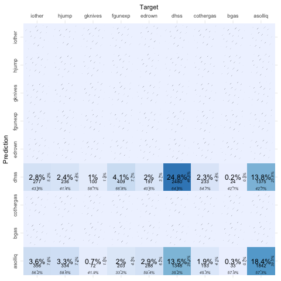
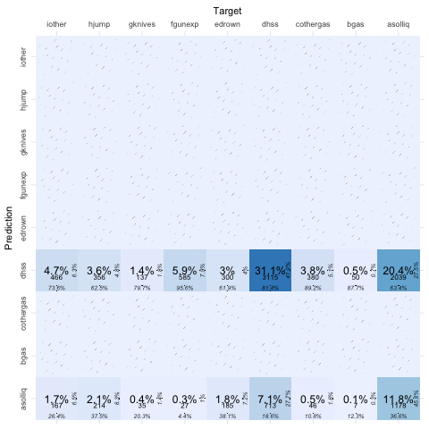

\renewcommand{\thefigure}{S\arabic{figure}}
\setcounter{figure}{0}
\renewcommand{\thetable}{S\arabic{table}}
\setcounter{table}{0}
\renewcommand{\theequation}{S\arabic{equation}}
\setcounter{equation}{0}


```{r, include=FALSE, message=FALSE}
library(lba)
library(lbann)
library(knitr)
knitr::opts_chunk$set(echo = FALSE, message = FALSE)
library(kableExtra)
library(keras)
library(tensorflow)
library(ggplot2)
library(tidyverse)
```

# Data Generating Mechanism of Example 1
```{r}
dgm.ex1 <- data.frame(Variable = c("P", "U", "Y", "$\\epsilon$"),
                      Meaning = c("observed predictor", "unobserved predictor", "response variable", "error term"),
                      Simulation = c("$Pr(X = p) = 1/6$ $p \\in \\{1, 2, ..., 6\\}$", 
                                     "$Pr(X = u) = 1/3$ $u \\in \\{1, 2, 3\\}$",
                                     "$\\tilde{Y} = 1+2*P+0.2*U+\\epsilon$ Y was formed by categorizing $\\tilde{Y}$ at the boundary of $Q_0$, $Q_1$, $Q_2$, $Q_3$ and $Q_4$ [note]",
                                     "$\\epsilon \\sim N(0,1)$"),
                      Categories = c("6 categories, ranging from 1 to 6", "3 categories, ranging from 1 to 3",
                                     "4 categories, ranging from 1 to 4", "-"))

dgm.ex1 %>% 
  kbl(booktabs = T,escape = F,caption = "Summary of variables in example 1", valign = T) %>% 
  kable_styling(full_width = F, latex_options = "HOLD_position") %>% 
  column_spec(3, width="4cm") %>% 
  row_spec(0,bold = T) %>% 
  add_footnote("$Q_0$, $Q_1$, $Q_2$, $Q_3$ and $Q_4$ refer to the minimum, first quantile, second quantile, third quantile and maximum value of the data", escape = F, notation = "symbol", threeparttable = T)
```

# Application on Example 3
In this section, we provide example 3 for the application of LBA-NN. The German Suicide dataset is extracted from the previous paper [@Heijden1992]. A summary of the data is provided in Table \ref{tab:tabex3}. Two explanatory variables are involved in this example, gender with 2 levels and age with 17 levels. The response variable, causes of death contains 9 categories. The original dataset was split to a training set and a test set, with 43211 and 10000 observations, respectively. Three latent budgets are assigned in LBA. The optimal hyperparameters includes 32 hidden neurons, the ReLU activation for the hidden layer and the softmax activation for the output layer, learning rate of $10^{-4}$.

```{r tabex3}
data <- read.csv("data_3.csv")
cont <- rbind(table(data %>% filter(gender == "male") %>% dplyr::select(-gender)),
      table(data %>% filter(gender == "female") %>% dplyr::select(-gender)))
cont <- addmargins(cont)
kbl(cont, booktabs = T, caption = "The contingency table for the example data 3") %>% 
  kable_styling(latex_options = c("HOLD_position", "scale_down")) %>% 
  pack_rows("Male", 1,17) %>% 
  pack_rows("Female", 18,34) %>% 
  add_header_above(c(" ","Causes of Death[note]" = 9)) %>% 
  add_footnote(paste("asolliq: ingestion of solid or liquid matter; bgas: gas poisoning at home;",
               "cothergas: poisoning by other gas; dhss: hanging, strangling and suffocation;",
               "edrown: drowning; fgunexp: guns or explosives; gknives: knives, etc.;",
               "hjump: jumping; iother: other methods"),notation = "symbol")
```

The estimated parameters from the LBA are shown in Table \ref{tab:lbaex3}. Latent budget 1 is mainly for younger adults from 15 to 50 years old and characterized by death from solid or liquid matter, poisoning of gases, gun or explosives and other methods. Latent budget 2 is composed of elderly females (more than 50 years old) who were dead from solid or liquid matter, drowning and jumping. Latent budget 3 contains mainly males (over almost all age ranges) who died from hanging, strangling or suffocation, gun or explosives and knives.

```{r lbaex3,cache=TRUE}
data <- read.csv("traindata_3.csv")
prop <- as.numeric(summary.factor(as.factor(data[,3]))/nrow(data))
set.seed(1)
conedu <- lba(cause.of.death ~ gender + age, data = data, K = 3, method = "ls", trace.lba = F)
mixing <- format(round(as.data.frame(conedu$A),2), nsmall = 2)
mixing <- rbind(mixing, `\\textbf{budget propotion}` = c(round(conedu$pk,2), ""))
mixing <- cbind(rownames(mixing), mixing, p = rep("",5))
colnames(mixing) <- c("Mixing parameters","k = 1", "k = 2", "k = 3", "")
row.names(mixing) <- NULL

lat <- format(round(as.data.frame(conedu$B),2), nsmall = 2)
lat <- cbind(rownames(lat), lat, format(round(prop,2),nsmall = 2))
lat <- rbind(c("\\textbf{Latent budgets}","\\textbf{k = 1}", "\\textbf{k = 2}", "\\textbf{k = 3}", "$p_{+j}$"), lat)
colnames(lat) <- colnames(mixing)
row.names(lat) <- NULL
example3.lba <- rbind(mixing, lat)

kbl(example3.lba, booktabs = T, caption = "Parameter Estimates from the Latent Budget Analysis of Example 3", align = "c", escape = F) %>% 
  row_spec(0,bold=TRUE) %>% 
  kable_styling(latex_options = "HOLD_position", position = "center") 
```

The corresponding qualitative evaluation of LBA-NN is shown in an importance plot in Figure \ref{fig:impex3}. Notably, in the first panel, the death from solid or liquid matter is mainly for younger adults, reflected by higher importance values. Similar patterns are observed in death from all kinds of gas, gun or explosives and other methods. The females shows higher importance in the causes such as solid or liquid matter, drowning and jumping. On the contrary, males contribute more to causes including all kinds of gas, hanging, strangling or suffocation, gun or explosives and knives. The biplot derived from the importance table is shown in Figure \ref{fig:bipex3}. Note that three clusters are predefined so as to compare with the LBA (with three latent budgets) on the same level. Cluster 1 is characterized by death from all kinds of gas and gun or explosives. Cluster 3 is only composed of death from hanging, strangling or suffocations. 

\begin{figure}[H]
\centering
\includegraphics[width=0.8\textwidth]{figure/S1_importance_plot_example_3.png}
\caption{The importance plots of example 3 from LBA-NN. (x axis: categories of 2 variables, gender and age; y axis: importance value; each grid: for the categories of the response variable, cause of death) \label{fig:impex3}}
\end{figure}

\begin{figure}[H]
\centering
\includegraphics[width=0.7\textwidth]{figure/S2_biplot_example_3.png}
\caption{The biplot of example 3 from LBA-NN. (three clusters were predefined; explanatory categories presented in inverted triangle; response categories presented in points)
\label{fig:bipex3}}
\end{figure}

Apart from the qualitative evaluation, both models were implemented on the test dataset to compare their predictive abilities. The confusion matrices of the predictions from both models are shown in Figure \ref{fig:S3}. Both LBA and LBA-NN failed to predict causes other than solid or liquid matter and hanging, strangling or suffocation. The quantitative indicators are summarized in Table 8. Both models show similar performance in prediction. 


```{r S3, fig.cap="The confusion matrices of LBA-NN and the LBA for example 3 (a: LBA-NN; b: LBA)", fig.subcap=c("", ""), out.width='.4\\linewidth',fig.show='hold',fig.align='center'}


```


```{r sumex3}
sumex3 <- data.frame(LBANN = c(0.08, 0.43, "-", 0.14, "0.90","-"),
                     LBA = c(0.11, 0.43,"-", 0.13, "0.90","-"))
rownames(sumex3) <- c("mean square error", "accuracy", "precision", "recall", "specificity", "f1-score")
colnames(sumex3) <- c("LBA-NN", "LBA")

sumex3 %>% 
  kbl(booktabs = T, caption = "Summary of predicative abilities of the two models for example 3", align = 'c') %>% 
  kable_styling(latex_options = "HOLD_position", position = "center", full_width = F) %>% 
  column_spec(1, bold = T, width = "5cm") %>% 
  column_spec(2:3, width = "3cm") %>% 
  row_spec(0, bold = T) %>% 
  footnote(general = "Recall is also named as sensitivity. Since both LBA-NN and the LBA fail to predict classes other than “asolliq” and “dhss”, the precision and f1-score for LBA and LBA-NN are NA.",threeparttable = T, fixed_small_size = T)
```

In this example, LBA-NN shows the same bad performance as LBA. Both methods were only able to predict two categories in the response variable. There are two underlying reasons. Firstly, group imbalance is obvious in the original dataset. The vast majority of the observations died from two categories, solid or liquid matter and hanging, strangling or suffocation. With the existence of the group imbalance, LBA-NN prioritized observations dead from the two causes during optimization to ensure the relatively low mean square error. In addition, unlike the other two examples, the explanatory variables in example 3 has in essence lower predictive ability. Intuitively, it can be extremely hard to predict causes of death only based on gender and age.

However, LBA-NN still produces fairly similar interpretation to LBA. For instance, cluster 1 composed of the causes including all kinds of gas, gun or explosives and other methods is similar to latent budget 1 from LBA. Cluster 3 composed of the death from hanging, strangling or suffocation is similar to latent budget 3 from LBA. 

# Reference